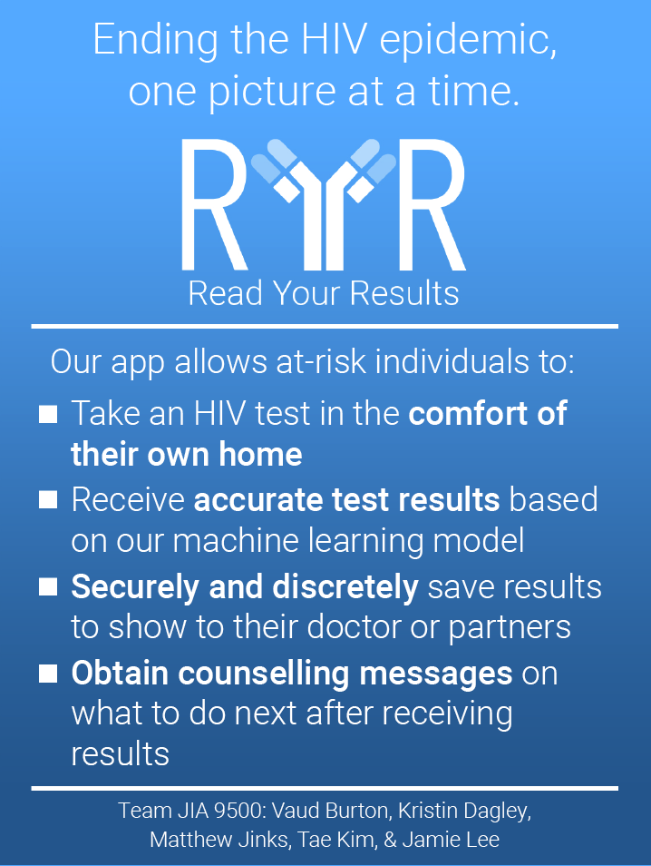

# Read Your Results

## RELEASE NOTES: Read Your Results Version 1.0

### New Software Features
- Significant improvements machine learning model accuracy compared to the last release
  - Preprocessing was applied to input and training images to increase result accuracy
    - Preprocessing involves using multiple informed crops
    - Informed crop incorporates computer vision techniques such as Gaussian blur, Canny Edge detection and Hough feature detection to filter vertical and horizontal lines and construct an inner rectangle from which to crop the image
  - Manually alter copies of training images to increase data volume
- Change password feature added
- Major UI updates
- Automatic detection and image capture feature added
  - The app is now capable of detecting the testing device and capturing an image for analysis when the analysis reaches a confidence measure of greater than 0.7 (threshold can be adjusted)
- Counseling messages that display on the results screen have been updated according to client specifications

### Bug Fixes
 - Fixed main screen user interface appearing in other parts of the program
 - Fixed persistent data not being deleted upon uninstalling the app

### Known Bugs
- When pushing the image capture button in the camera view, sometimes the app will go back to the home page and show the home screen combined with the Select Device screen. This bug occurs infrequently

## PRE-REQUISITES
- This program requires the Android Operating System with an API level of 21 (Android 5.0/Lollipop) or higher.

## DEPENDENCIES
None

## DOWNLOAD
[Link](https://github.com/JamieLee629/YellowJacketDevs/blob/master/app-release.apk?raw=true)

## INSTALLATION GUIDE

- Download the apk on your Android device here: [Download Link](https://github.com/JamieLee629/YellowJacketDevs/blob/master/app-release.apk?raw=true)
- Open the apk on your android device
- After the download completes, open the app from your phone by either:
  - Clicking the item in the [notification bar](notification.png) or
  - Opening the apk file from your phone's [file explorer](filexplorer.png)
- Allow installation of applications from an unknown source by clicking [Settings > Allow from this source](unksourcseinstall.png)

## RUNNING THE APPLICATION
- Open application from Android device
- More information about how to use the app can be found on the Help screen in the app

## TROUBLESHOOTING
- If you have downloaded an older version of the app, you may need to uninstall it manually first and then install the new apk
