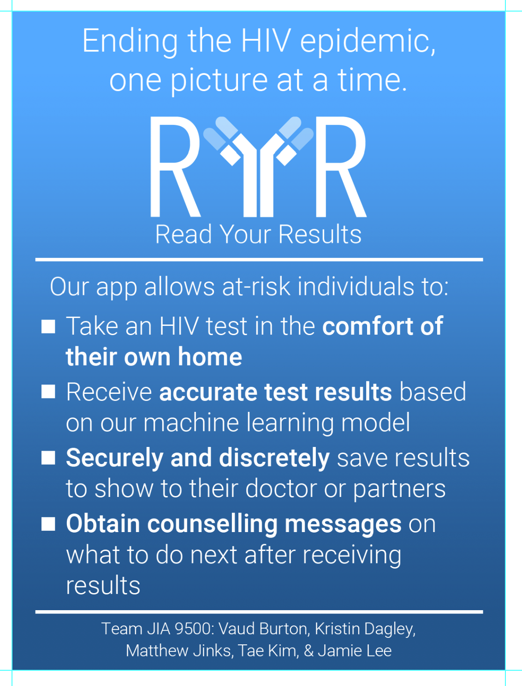

# YellowJacketDevs

## RELEASE NOTES
### New Software Features in This Release:
 - Automatic detection and image capture of testing device
 -- The app is now capable of detecting the testing device and capturing an image for analysis when the analysis reaches a confidence measure of greater than 0.7 (threshold can be adjusted).
 - Counseling messages that display on the results screen have been updated according to client specifications.

## INSTALLATION GUIDE

1. Download the apk
2.